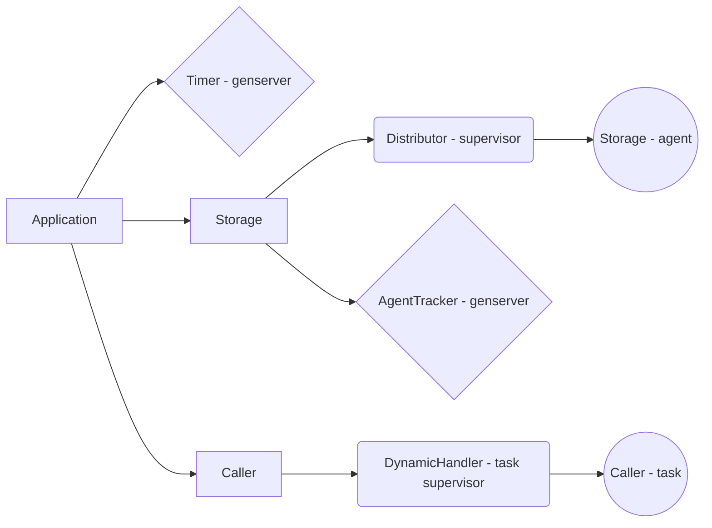

# AdvancedAggregator

AdvanceAggregator is an application from a personnal project.
There is no database, as it was intended to be used in a umbrella app with a dedicated database app.

The idea is to call APIs from multiple sources (here social medias) to get data and format them.
The call is done every N minutes.

## installation

To test AdvancedAggregator, you'll need to

```bash
$> mix deps.get
$> mix test
```

## Explanation

The idea being this advanced aggregator is simple:
There is data to shape what you want to get
There is a timer allowing repetition
There is a 



The `Timer` call the `Agent tracker` to get an agent.

The `Tracker` has the list of all `Storage` agent. When called, it get the first agent in its list, and put it at the end. It then returns a list of data stored in the agent.
Once the `Timer` get the list of data from the `Tracker`, it call the `DynamicHandler` and give it the list from the agent.
The `DynamicHandler` then create a `Caller` for each element in the list.
The `Caller` then call the endpoint linked to the element, and handle the answer.

Handling data include decode from json, format, sending it to the Redis database and finaly to the webhooks.
Redis and webhooks aren't handled as they should be in a different application of your umbrella app.

There is another folder, which is the `api` folder. It should contains any files associated to the api you want to call.

The `mock_test` file is here to handle

## Tests

If you want fast test, feel free to update the configuration and change any number down.

There is actually only one test environment, the default one.
It is mostly unit test, and the coverage isn't full (as I haven't find a way to test the `Timer` loop)

`test/support/gen_social_medias.ex` as an important role in the test. It will mock multiple answers as there is no server to call, and need .

## Main features to add/change
[] add another test environment
[] separate the call and the answer managment
[] create a client to test calls
[] add another layer of supervisor to separate the APIs and sources
[] update entity inside of an agent
[] remove an entity inside of an agent
[] had better tests on the `Caller`
[] find a way to simulates webhooks